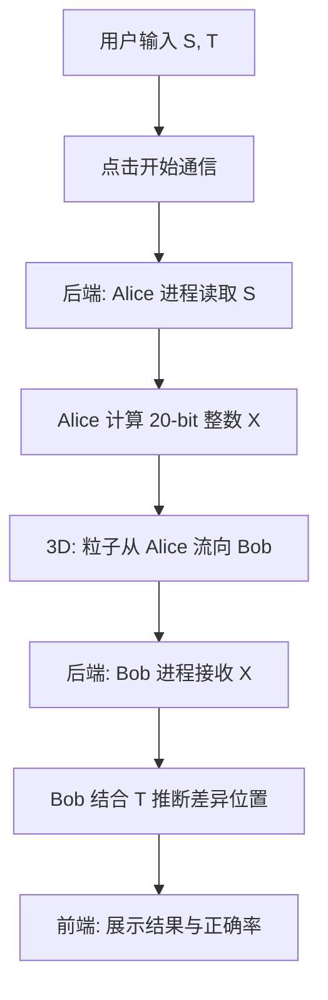

## 1. 产品概述

OJ 通信题可视化沙盒 —— 一个帮助用户直观理解"两个独立进程传信息"过程的全栈 Web 应用。通过 3D 场景模拟 Alice 和 Bob 两个 AI 进程，用户输入两个 01 串 S 和 T，后端模拟进程隔离完成通信计算，前端以动态粒子流展示数据传递全过程。

- 目标用户：算法竞赛选手、计算机科学学生、对通信复杂度感兴趣的开发者
- 核心价值：将抽象的"通信题"过程具象化，用沉浸式 3D 动画帮助理解进程隔离与信息传递

## 2. 核心功能

### 2.1 功能模块

1. **沙盒主页**：3D 场景 + 输入控制面板 + 结果展示区

### 2.2 页面详情

| 页面名称 | 模块名称 | 功能描述 |
|----------|----------|----------|
| 沙盒主页 | 3D 场景 | 展示 Alice 和 Bob 两个 AI 实体，粒子流动画展示通信过程 |
| 沙盒主页 | 输入面板 | 用户输入两个 01 串 S 和 T，支持随机生成、长度设置 |
| 沙盒主页 | 结果面板 | 展示 Alice 计算的 20-bit 整数 X、Bob 推断的不同位置、正确率 |
| 沙盒主页 | 状态栏 | 显示当前通信阶段（等待输入 → Alice 计算 → 传输中 → Bob 推断 → 完成） |

## 3. 核心流程

1. 用户在输入面板输入两个 01 串 S 和 T（或随机生成）
2. 点击"开始通信"按钮
3. 后端模拟 Alice 进程：Alice 仅能看到 S，计算 20-bit 整数 X
4. X 通过"信道"传输给 Bob（3D 场景中粒子从 Alice 流向 Bob）
5. 后端模拟 Bob 进程：Bob 接收 X 并结合 T，推断 S 和 T 的不同位置
6. 前端展示完整结果：X 的二进制表示、Bob 推断结果、实际差异、正确率

### 3.1 通信算法说明

- Alice 端：将 S 按每 20 位分组，对每组做异或校验和，最终将所有组的校验和压缩为 20-bit 整数 X。这是一种有损编码，能在有限比特内尽可能传递 S 的结构信息。
- Bob 端：接收 X 后，结合自身持有的 T，通过对比校验和差异来推断 S 和 T 可能在哪些位上不同。当 |S| ≤ 20 时，Alice 直接传输 S 本身，Bob 可精确定位所有差异位。

## 4. 用户界面设计

### 4.1 设计风格

- **主题**：赛博朋克 / 科技实验室风格
- **主色调**：深黑背景 (#0a0a0f)，电光蓝 (#00e5ff) 作为主强调色，霓虹绿 (#39ff14) 作为次强调色
- **字体**：显示字体用 Orbitron（科技感），正文用 Source Code Pro（代码感）
- **按钮**：圆角边框按钮，hover 时发光效果（box-shadow glow）
- **布局**：左右分栏——左侧 3D 场景占主体，右侧控制面板

### 4.2 页面设计概览

| 页面名称 | 模块名称 | UI 元素 |
|----------|----------|---------|
| 沙盒主页 | 3D 场景 | 深色空间背景，Alice(蓝光球体)和 Bob(绿光球体)悬浮于两侧，粒子流连接两者 |
| 沙盒主页 | 输入面板 | 深色卡片，两行输入框分别标注 S/T，带随机生成按钮，底部"开始通信"发光按钮 |
| 沙盒主页 | 结果面板 | 深色卡片，X 的二进制可视化（20 个方格），差异位高亮对比表，正确率百分比 |
| 沙盒主页 | 状态栏 | 顶部细条，根据阶段变色（蓝→传输中→绿→完成） |

### 4.3 响应式设计

- 桌面优先，3D 场景与控制面板左右分栏
- 平板端上下布局
- 移动端简化 3D 为静态背景，聚焦控制面板

### 4.4 3D 场景设计

- **环境**：深空黑背景，微弱星空粒子，营造实验室/太空站氛围
- **灯光**：环境光微弱，Alice 和 Bob 各自带有对应颜色的点光源
- **相机**：透视相机，45° 俯视角，OrbitControls 允许用户旋转观察
- **Alice 实体**：蓝色发光八面体（Octahedron），缓慢自旋，外层半透明光晕
- **Bob 实体**：绿色发光八面体，缓慢自旋，外层半透明光晕
- **粒子流**：通信时从 Alice 发射粒子群，沿贝塞尔曲线飞向 Bob，粒子颜色从蓝渐变到绿，到达 Bob 时被吸收闪烁
- **后处理**：Bloom 泛光效果增强发光体视觉冲击力
