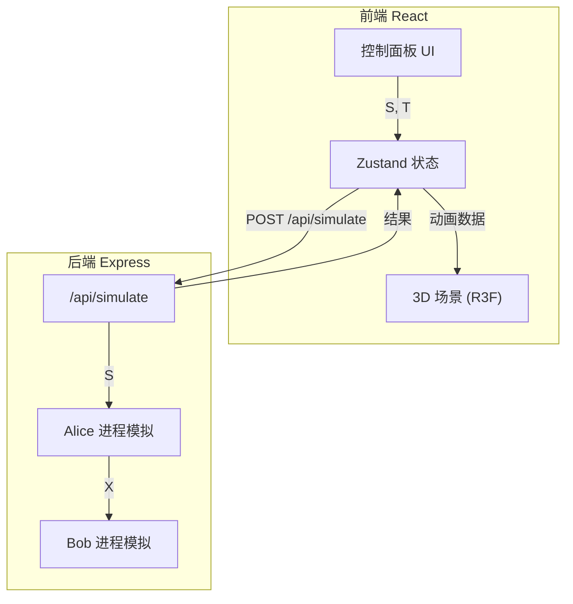

## 1. 架构设计



## 2. 技术说明

- **前端**：React@18 + TypeScript + Vite + Tailwind CSS + Zustand
- **3D 引擎**：three + @react-three/fiber + @react-three/drei + @react-three/postprocessing
- **初始化工具**：vite-init (react-express-ts 模板)
- **后端**：Express@4 + TypeScript (ESM)
- **数据库**：无（纯计算模拟，无需持久化）

## 3. 路由定义

| 路由 | 用途 |
|------|------|
| / | 沙盒主页，包含 3D 场景和控制面板 |

## 4. API 定义

### POST /api/simulate

**请求体：**
```typescript
interface SimulateRequest {
  S: string;
  T: string;
}
```

**响应体：**
```typescript
interface SimulateResponse {
  X: number;
  XBinary: string;
  alicePhase: {
    input: string;
    output: number;
    outputBinary: string;
  };
  bobPhase: {
    input: { X: number; T: string };
    inferredDiffPositions: number[];
  };
  actualDiffPositions: number[];
  correctPositions: number[];
  accuracy: number;
}
```

## 5. 通信算法实现

### Alice 端算法
- 若 |S| ≤ 20：X = parseInt(S, 2)，直接传输整个字符串
- 若 |S| > 20：将 S 分为 ceil(|S|/20) 组，每组 20 位，不足补零。对各组做 XOR 得到 20-bit 校验和 X

### Bob 端算法
- 若 |T| ≤ 20：直接用 X 的二进制与 T 逐位比较，返回所有差异位
- 若 |T| > 20：将 T 分为同样分组，计算 T 的 XOR 校验和 X'，对比 X 和 X' 找出差异组，返回差异组内所有位（粗粒度定位）

## 6. 前端状态模型

```typescript
interface SimulationStore {
  S: string;
  T: string;
  phase: 'idle' | 'alice_computing' | 'transmitting' | 'bob_computing' | 'complete';
  result: SimulateResponse | null;
  setS: (s: string) => void;
  setT: (t: string) => void;
  startSimulation: () => Promise<void>;
  reset: () => void;
}
```
